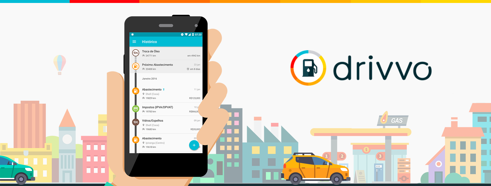

 [![BuyMeCoffee][buymecoffeebedge]][buymecoffee] [](https://github.com/hacs/integration)

# Drivvo Custom Integration Home Assistant



Custom integration for the Home Assistant to obtain information present in [drivvo.com](https://www.drivvo.com/).

## Install

### Installation via HACS

Have HACS installed, this will allow you to update easily.

[](https://my.home-assistant.io/redirect/hacs_repository/?owner=hudsonbrendon&repository=sensor.drivvo&category=integration)

If the button above doesn't work, you can also perform the following steps:

- Add `https://github.com/hudsonbrendon/sensor.drivvo` as a custom repository of type Integration in HACS.
- Click Install on the `Drivvo` integration.
- Restart the Home Assistant.

### Manual installation

- Copy `drivvo`  folder from [latest release](https://github.com/hudsonbrendon/sensor.drivvo/releases/latest) to your `<config dir>/custom_components/` directory.
- Restart the Home Assistant.

## Configuration

Adding Drivvo to your Home Assistant instance can be done via the UI using this button:

[](https://my.home-assistant.io/redirect/config_flow_start?domain=drivvo)

### Manual Configuration

If the button above doesn't work, you can also perform the following steps manually:

* Navigate to your Home Assistant instance.
* In the sidebar, click Settings.
* From the Setup menu, select: Devices & Services.
* In the lower right corner, click the Add integration button.
* In the list, search and select `Drivvo`.
* Follow the on-screen instructions to complete the setup.

## Debugging

To enable debug for Drivvo integration, add following to your `configuration.yaml`:
```yaml
logger:
  default: info
  logs:
    custom_components.drivvo: debug
```

## Make a card

To view drivvo information, follow an example of a card. Remember to replace the entities present on the card with your entities.


```yaml
type: custom:config-template-card
entities:
  - sensor.nissan_march_abastecimento
card:
  type: entities
  show_header_toggle: 'off'
  style: |
    .card-header {
      padding: 0px 0px 0px 0px !important;
    }
  entities:
    - type: custom:hui-vertical-stack-card
      cards:
        - type: horizontal-stack
          cards:
            - type: picture
              style: |
                ha-card {
                    --paper-card-background-color: 'rgba(0, 0, 0, 0.0)';
                    --ha-card-background: "rgba(0, 0, 0, 0.0)";
                    --ha-card-box-shadow: 'none';
                }
              image: /local/images/nissan.png
            - type: custom:button-card
              layout: icon_name_state2nd
              show_icon: true
              show_state: true
              styles:
                grid:
                  - grid-template-columns: 50px auto
                icon:
                  - padding: 0px 0px
                  - height: 100px
                  - width: 30px
                card:
                  - '--ha-card-background': rgba(0, 0, 0, 0.0)
                  - '--ha-card-box-shadow': none
                state:
                  - padding: 0px 10px
                  - justify-self: start
                  - font-family: Roboto, sans-serif
                  - font-size: 15px
                name:
                  - padding: 0px 10px
                  - justify-self: start
                  - color: var(--secondary-text-color)
              entity: device_tracker.nissan_march
              name: Localização
              icon: mdi:car
        - type: custom:bar-card
          show_icon: true
          align: split
          columns: 1
          max: 41
          positions:
            icon: inside
            indicator: inside
            name: inside
            value: inside
          unit_of_measurement: Litros
          animation: 'on'
          severity:
            - color: '#fd0000'
              from: 1
              to: 19
            - color: '#ffaa00'
              from: 20
              to: 29
            - color: '#2CE026'
              from: 30
              to: 41
          style: |
            ha-card {
                --paper-card-background-color: 'rgba(0, 0, 0, 0.0)';
                --ha-card-background: "rgba(0, 0, 0, 0.0)";
                --paper-item-icon-color: 'var(--text-primary-color';
                --ha-card-box-shadow: 'none';
            }
          entities:
            - entity: sensor.nissan_march_abastecimento
              attribute: volume_de_combustivel
          name: Volume de combustível
          entity_row: true
        - type: custom:apexcharts-card
          chart_type: line
          header:
            title: Nissan March
            show: true
            show_states: true
            colorize_states: true
          series:
            - entity: sensor.nissan_march_abastecimento
              attribute: odometro
              type: column
              name: Odômetro
              unit: km
            - entity: sensor.nissan_march_abastecimento
              attribute: preco_do_combustivel
              type: column
              name: Preço atual da gasolina
              unit: R$
              float_precision: 2
            - entity: sensor.nissan_march_abastecimento
              attribute: valor_total_pago
              type: column
              name: Valor total pago
              unit: R$
              float_precision: 2
            - entity: sensor.nissan_march_abastecimento
              attribute: soma_total_de_valores_pagos_em_todos_os_abastecimentos
              type: column
              name: Total pago em todos os abestecimentos até então
              unit: R$
              float_precision: 2
            - entity: sensor.nissan_march_abastecimento
              attribute: km_percorridos_desde_o_ultimo_abastecimento
              type: column
              name: Kms percorridos desde o último abastecimento
              unit: Km
            - entity: sensor.gasolina_media_natal
              type: column
              name: Preço médio da gasolina
              unit: R$
              float_precision: 2
            - entity: sensor.nissan_march_abastecimento
              type: column
              name: Abastecimentos
              unit: Abastecimentos
```

After setup, the card above will look like this:


[buymecoffee]: https://www.buymeacoffee.com/hudsonbrendon
[buymecoffeebedge]: https://camo.githubusercontent.com/cd005dca0ef55d7725912ec03a936d3a7c8de5b5/68747470733a2f2f696d672e736869656c64732e696f2f62616467652f6275792532306d6525323061253230636f666665652d646f6e6174652d79656c6c6f772e737667
